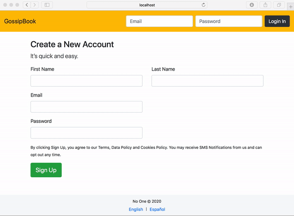

# Context API Challenge 2 - Nested Components

In Visual Studio code, press `command+shift+v` (Mac) or `ctrl+shift+v` (Windows) to open a Markdown preview.

## Reasons for the Challenge

In most real world scenarios, React applications have a hierarchy of components. The Context API is used to share state between many of the components within this hierarchy. This exercise takes what you completed in the first challenge and spreads it out between multiple nested components.

### Examples

Here are some examples of using the Context API across multiple files and components:

- [Initializing the Context API in the top-level ("App") component](https://codesandbox.io/s/406y2lqyl9?fontsize=14&hidenavigation=1&theme=dark)
- [Initializing the Context API in its own component](https://codesandbox.io/s/usecontext-v36ew?fontsize=14&hidenavigation=1&theme=dark)

## Getting Started

Using your command line, you will need to navigate to the this folder, install all dependencies, and start the app.

```bash
cd exercises/08b-context-api/
code . # if you would like to open this in a separate VSCode window
yarn install
yarn start
```

## User Stories

As a user, I would like to click a button to change the language to English ("en") and Spanish ("es").



As an engineer, I need a way to share the application's current language to all of the components in my application that need to be translated.

## Acceptance Criteria

- You must use the Context API to store the language locale ("en" or "es").
- The "CreateAccount", "Login", "Footer" and "Languages" components must get their state from the Context API.
- When the user clicks on "English" or "Spanish" in the footer, it should change all the copy inside of the "CreateAccount", "Login" and "Footer" components to the desired language.

Note that you do not need to make the forms functional.

## Instructions

You will be storing the application's language locale ("en" or "es") and the callback to update the language (e.g. "setLanguage") within of the Context API. You will need to import and initialize the Context API with `createContext()`:

```javascript
const TranslatorContext = createContext();
```

One suggestion is to create a new component where you can initialize `createContext()`. Alternatively, you can call upon `createContext()` within _src/components/App/App.jsx_. You will need to export "TranslatorContext".

Inside of _src/components/App/App.jsx_, initialize state and set up the "TranslatorContext" Provider.

Open _src/components/CreateAccount/CreateAccount.jsx_. You will need to use `useContext()` to get the current language locale ("en" or "es") and the list of translations for the current language. Repeat for _src/components/Footer/Footer.jsx_ and _src/components/Login/Login.jsx_.

The component "Languages" inside of _src/components/Languages/Languages.jsx_ has the buttons that the user can click on to change the current language. You will need to call upon `useContext()`. You will also need to attach an event handlers to the buttons that will update the language.
